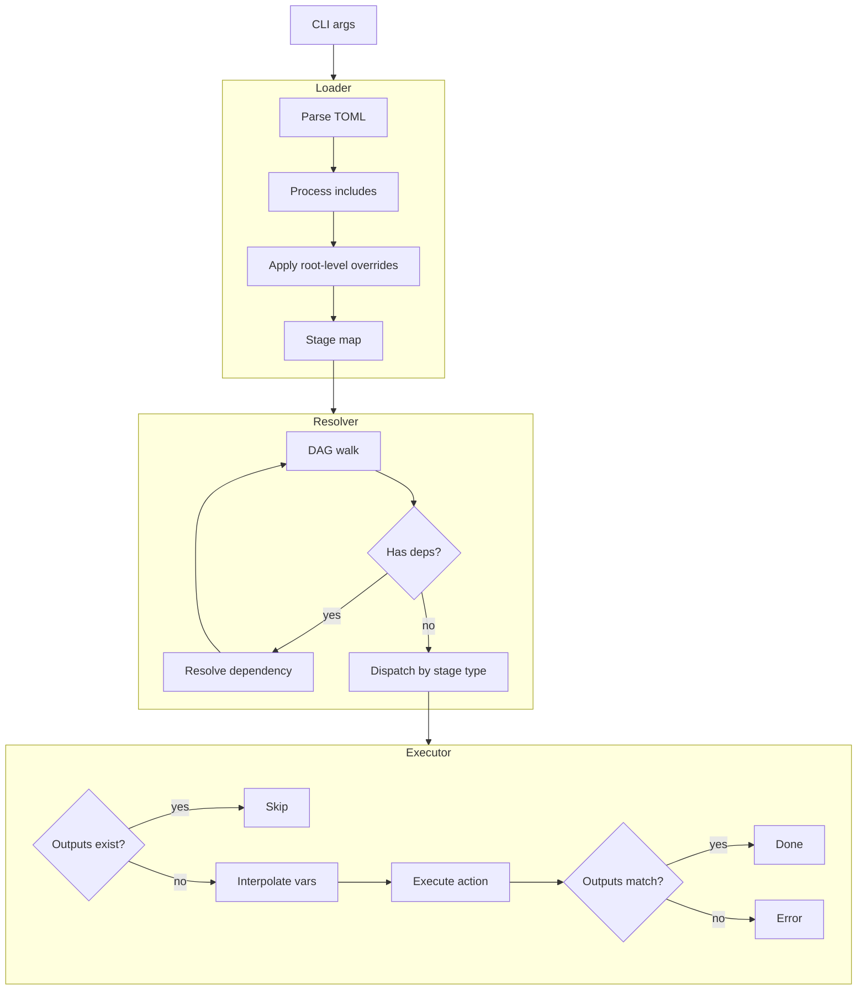

# Architecture

predep is a stage-processing engine. It reads a declarative TOML manifest,
resolves stages and their dependencies, and produces artifacts. **It is not
tied to any specific project** — the stages in `predep.toml` define what it
does.

## Application flow ([mermaid live)](https://mermaid.live/edit#pako:eNp9Ul1vmzAU_SuWn5OIdEAID6u6ptsipWrVVqtUw4MLNwkq2JZtsjDKf58NSSDtNCRs33vPud81TngKOMQbScUWPX2LGDKfKl87xYrTFGSntN89lQpIe6Knu9tVjMbjr2jJkrxMQZF7yRNQCmUHRdwzj5iWcAtyA-RKiLxCknM9zmEHOeI7kDI757XQjkQFedTUSAUVBwSwNGIfcn4AxfPdMOtnmr-RxdUP9Ns8upQXIOqfVKEUhLpseqjRW_t7BerdCooc3FmkiQYsqeIzeFeRDfHZC-PGSaYE1cmWHB_otUKqrUNXAv5TyM0eklLzQSEPQNOqviu1KLVCsM-Uvmz6fB_fMtMic8QfKKdklkyDFKS7eE41oJ0Z5tmcrKmtqYsP5HAjmuiMswH2aLDgXyCzdZ9bYSsdNrazD3rLGRB7xP_E2GS_0ywnN1Jy-blJ16slMT-icqO6iQ5X1axKqztfhdMA-uK4xCOz-1mKQy1LGOECZEGtiGtLirDeQgERDs0zhTUtcx3hiDWGJih74bw4MiUvN1scrmmujFSK1DR3kVEzyuKklXaD5DUvmcbhl4tZ6wSHNd7j0HUn7mw68y6mvj9zA8cb4QqHY9-Z-J7rzR3f8f1g7nrNCP9pw04nfuAbrONMvbnvzoOg-QvhUzIu)

1. **Entry point** parses CLI flags (stage name, platform, debug mode,
   config path). Discovers the project root by walking up from the working
   directory looking for `predep.toml`.

2. A **runtime context** is assembled with the resolved root path, cache
   directory, target OS, logger, and prompter.

3. The **engine** loads the manifest — parses the root TOML, recurses into
   `[[include]]` entries, merges stages under their namespaces, and
   interpolates `${VAR}` references.

4. The **resolver** takes the requested stage name and walks the dependency
   graph. Cycles are detected and rejected. Each stage is dispatched to its
   registered **action handler** by type.

5. Each **action handler** checks whether outputs already exist (skip if so),
   executes its work, and verifies declared outputs.

## Dependencies

### Build-time

* **premake5** — meta-build system (generates Makefiles / VS solutions)

* **C++23 compiler** — g++ (Linux), clang (macOS), MSVC (Windows)

* Docker images in `images/` allow building without premake5 or system libs

### Runtime (linked)

* **libcurl** — HTTP downloads (Unix: system curl, Windows: libcurl.dll)

* **OpenSSL / libcrypto** — SHA256 verification (WinSSL on Windows)

* **libpthread** — threading support (Linux only)

### Vendored (in-tree)

* **toml++** — TOML parsing

* **CLI11** — CLI argument parsing

## Cross-platform support

### Build

* premake5 generates platform-native build files: Makefiles for Linux/macOS,
  Visual Studio solutions for Windows

* Docker-based cross-compilation (Linux → Windows via MinGW)

* Single codebase with platform-conditional linkage

* All file operations use C++17 `std::filesystem`

### Runtime

* `platform::os()` detects the host OS at startup

* Cache directory is resolved per-platform convention

* Shell command detection: `cmd /c` on Windows, `/bin/sh -c` on Unix

* Archive format: tar.gz on Unix, zip on Windows

* All paths use native separators via `fs::path::operator/`

### Config portability

* TOML manifests are platform-agnostic

* `[platform.<os>]` overrides provide per-OS settings in the same manifest

* `${OS}`, `${PLATFORM}`, `${ARCH}` adapt URLs and paths to the target
